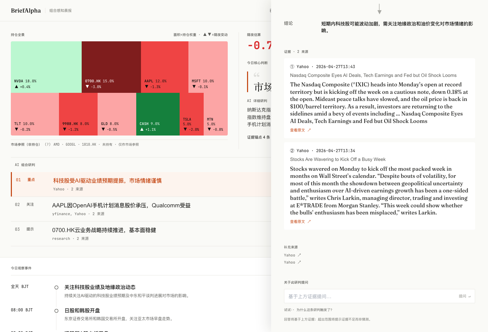

# BriefAlpha

Family-office morning brief MVP — produces an evidence-grounded, citation-traceable, minimum-disclosure morning brief by 08:30 HKT.

> Source of truth for visual design: `docs/Designs/BriefAlpha.pen` (Chinese frames `fFOSV`, `uOtTm`, `I4Qnp`, `Nh2S4`).
> Source of truth for behavior: `openspec/changes/build-briefalpha-mvp/`.

## Structure

```
apps/
  api/        FastAPI + APScheduler + SQLAlchemy + SQLite (FTS5) + Redis
  web/        Next.js 14 App Router + TS + Tailwind + react-pdf + Zustand
packages/
  prompts/    JSON LLM prompt templates with template_version
  config/     Shared YAML configs (sector overrides, alias_zh, data sources)
data/         Runtime data (gitignored: SQLite DB, encrypted alias_maps, PDFs)
scripts/      Dev / ops scripts (init_secrets, backups)
tests/        Cross-repo integration + golden tests
openspec/     Spec-driven workflow (proposals, designs, capabilities, tasks)
docs/         Designs (.pen) and reference docs
```

## Prerequisites

- Python 3.11
- Node.js 20+ (with [pnpm](https://pnpm.io/))
- Redis 7+ (`brew install redis` or Docker)
- [uv](https://github.com/astral-sh/uv) (recommended for Python)

## First-time setup

### Recommended setup

1. Install dependencies.

```bash
pnpm install
cd apps/api && uv sync && cd ../..
```

1. Create local secrets, migrate the database, and seed the demo portfolio.

```bash
make init-secrets
make db-migrate
python scripts/seed_demo_portfolio.py
```

1. Configure `.env`.

```bash
BRIEFALPHA_MODE=live
BRIEFALPHA_LLM_PROVIDER=openai
BRIEFALPHA_AUDIT_MODE=demo
BRIEFALPHA_REDIS_URL=redis://localhost:6379/0
BRIEFALPHA_DB_URL=sqlite+aiosqlite:///./data/briefalpha.db
NEXT_PUBLIC_API_BASE_URL=http://localhost:8000

FINNHUB_API_KEY=...
NEWSAPI_KEY=...
```

1. Add LLM keys in `data/.secrets/llm_api_keys.json`.

```json
{
  "anthropic": "replace-me",
  "openai": "sk-...",
  "vision_openai": "sk-...",
  "vision_anthropic": "replace-me"
}
```

1. Confirm `packages/config/data_sources.yml`.

```yaml
sec:
  user_agent: "BriefAlpha/0.1 your.name@yourdomain.com"

providers:
  gdelt:
    enabled: false
  finnhub:
    enabled: true
  newsapi:
    enabled: true
  google_news_rss:
    enabled: true
```

1. Start the app in three terminals.

```bash
make dev-redis
make dev-api
make dev-web
```

Then open `http://localhost:3000`. The API runs in live mode, uses OpenAI
for text/vision, pulls market/news/official data, and can parse uploaded
research PDFs.

### Full setup guide

```bash
# 1. Install JS dependencies
pnpm install

# 2. Install Python dependencies
cd apps/api && uv sync && cd ../..

# 3. Generate local secrets (alias_key, admin_token, llm_api_keys.json placeholder)
make init-secrets

# 4. Apply database migrations
make db-migrate

# 5. (optional but recommended) Seed a demo portfolio so /api/brief/today
#    has something to anonymize over the privacy-safe universe.
python scripts/seed_demo_portfolio.py
```

After step 3, edit `data/.secrets/llm_api_keys.json` and replace the
`replace-me` strings with real provider keys. Without real keys, the
backend keeps running but every LLM call returns a deterministic stub
response (the rest of the pipeline + validators + audit log still
exercise correctly — useful for debugging).

For PDF/image captioning, set `vision_openai` to an OpenAI API key. If
`vision_openai` is omitted, the backend falls back to the regular `openai`
key. `vision_anthropic` may remain `replace-me` unless you re-enable the
Anthropic vision route.

`data/.secrets/admin_token` is a 64-char hex string. Pass it as
`Authorization: Bearer <token>` to access `/api/portfolio` and any
`/api/admin/*` endpoint.

## Run locally

In three separate terminals:

```bash
make dev-redis    # Redis on :6379
make dev-api      # FastAPI on :8000 (also starts APScheduler cron jobs)
make dev-web      # Next.js on :3000
```

If you don't have Redis available, set `BRIEFALPHA_DISABLE_REDIS=1` —
the cache layer degrades to no-op (every request triggers a fresh DB
read or — in demo mode — the fixture). To skip the cron scheduler too
set `BRIEFALPHA_DISABLE_SCHEDULER=1`.


## Switching modes (demo / live)

BriefAlpha runs in one of two modes, selected by the `BRIEFALPHA_MODE`
environment variable. The mode is **manual** — there is no
auto-detection, on purpose.


| Mode   | Default | What it does                                                                                                                                                                  | When to use                                                                    |
| ------ | ------- | ----------------------------------------------------------------------------------------------------------------------------------------------------------------------------- | ------------------------------------------------------------------------------ |
| `demo` | yes     | Serves a hand-curated fixture brief. Every "demo" surface is explicitly labeled (banner, source-health `(示例)`, evidence links open an internal modal). No external API calls. | First-time setup, design preview, demo to a reviewer without configuring keys. |
| `live` | opt-in  | Runs the real ingestion → brief → QA pipeline. Fail-fasts on startup if required preconditions are missing.                                                                   | Daily personal use after configuring keys.                                     |


### Default behavior (no config needed)

```bash
make dev-api    # equivalent to BRIEFALPHA_MODE=demo
```

The API starts with `BRIEFALPHA_MODE=demo`. The web app shows a persistent
orange banner: "示例数据 · 未配置真实数据源". `/api/brief/today` returns
the fixture (with `system.data_quality = "fixture"` so the UI can
distinguish honestly). QA falls back to a small set of pre-baked
keyword answers labeled "示例回答".

### Switching to live

```bash
# 1. Edit packages/config/data_sources.yml and replace
#      sec.user_agent: "BriefAlpha demo <ops@example.com>"
#    with a real contact, e.g.
#      sec.user_agent: "MyApp/1.0 alice@mycompany.com"
#    (SEC fair-use policy requires a real reachable email.)

# 2. Configure the LLM provider key matching BRIEFALPHA_LLM_PROVIDER.
export BRIEFALPHA_MODE=live
export ANTHROPIC_API_KEY=sk-ant-...   # if BRIEFALPHA_LLM_PROVIDER=anthropic
# export OPENAI_API_KEY=sk-...        # if BRIEFALPHA_LLM_PROVIDER=openai
make dev-api
```

If any of these are missing, the API logs each missing item and exits
with code 1 — by design, so you can never accidentally serve stale
fixture content as "live".

#### Live preconditions (fail-fast checklist)

- **A provider-specific LLM key matching `BRIEFALPHA_LLM_PROVIDER`.** Either:
  - The matching env var (`ANTHROPIC_API_KEY` if provider is `anthropic`,
  `OPENAI_API_KEY` if `openai`), OR
  - A non-placeholder value in `data/.secrets/llm_api_keys.json` under the
  matching provider key (the init script seeds `sk-ant-replace-me` etc. —
  those are detected as placeholders and rejected).
  - Note: setting only the *other* provider's key is not sufficient — the
  runtime LLM wrapper only consults the configured provider, so an
  Anthropic key with `BRIEFALPHA_LLM_PROVIDER=openai` would silently
  degrade to the conservative stub.
- `**sec.user_agent`** in `packages/config/data_sources.yml`, in the form
`AppName/version contact@yourdomain.com`. The default value contains
`example.com` and is rejected. SEC's RSS feed requires this header.

The current live ingestion path uses these real public sources:

- **Market:** yfinance first, Stooq fallback for US symbols. No key required.
- **News:** GDELT is disabled by default because it is often unreachable on
CN/HK networks. The adapter tries Finnhub if `FINNHUB_API_KEY` is set,
then NewsAPI if `NEWSAPI_KEY` is set, then Google News RSS as the key-less
fallback.
- **Official:** SEC EDGAR Atom/RSS and HKEX RSS. SEC requires the configured
`sec.user_agent`.
- **Research:** user-uploaded public/permissioned PDFs, parsed into
`source_tier=research` evidence.

For the best live demo, set `FINNHUB_API_KEY` and optionally `NEWSAPI_KEY`.
`ALPHA_VANTAGE_API_KEY` is still a placeholder for a future market adapter;
the current market code only uses yfinance/Stooq.

### Refresh button

The top-bar "刷新数据" button is mode-aware:

- **Demo:** invalidates the brief cache so the next page load re-stamps
`system.last_refreshed_at`, and shows `已刷新 HH:MM`. Does **not**
trigger ingestion (there's no real data to fetch).
- **Live:** invalidates the cache and respawns brief generation
(ingestion → pipeline → cache write). Shows `已排队，请稍候`.

## Quick smoke test

After `make dev-api` is up:

```bash
ADMIN_TOKEN=$(cat data/.secrets/admin_token)

curl -s http://localhost:8000/api/health
curl -s http://localhost:8000/api/brief/today | jq '.brief_id, .conservative'
curl -s http://localhost:8000/api/source-health | jq '.overall, .rows[0]'
curl -s -H "Authorization: Bearer $ADMIN_TOKEN" \
  http://localhost:8000/api/admin/diagnostics/conservative-brief-rate

curl -s -X POST http://localhost:8000/api/qa \
  -H "content-type: application/json" \
  -d '{"brief_id":"'"$(date -u +%Y-%m-%d)"'","scope":"global","question":"NVDA"}' | jq .
```

`/api/qa` returns `failure_reason: brief_expired` until the daily
07:55 HKT brief lands (or you trigger it manually via
`POST /api/admin/brief/regenerate`).

## Redis namespaces


| Key                                  | TTL                     | Purpose                           |
| ------------------------------------ | ----------------------- | --------------------------------- |
| `brief:{date}`                       | until next 07:55 freeze | Cached morning brief payload      |
| `source_health:latest`               | 5 min                   | Aggregated source health snapshot |
| `qa:context:{brief_id}:{scope}`      | follows `brief:{date}`  | QA history (last 3 turns)         |
| `research:queue` / `reanalyze:queue` | n/a (list)              | PDF parse + re-analyze queues     |


## Security boundaries (demo mode)

- All third-party LLM / embedding / vision calls go through `apps/api/llm/wrapper.py`.
Any other module that imports a provider SDK is blocked by `import-linter`.
- Evidence sent to LLM is reduced to the `AliasedEvidence` whitelist
(`evidence_id`, `title_aliased`, `excerpt_aliased`, `quote_span_aliased`,
`source_tier`, `asset_class`, `published_at`).
- `alias_map` ciphertext lives at `data/alias_maps/{brief_id}.enc` and is
destroyed at 16:00 HKT each day.
- `audit_mode = demo` by default — only request/response **hashes** are stored.
- Switching to `audit_mode = compliance` requires admin token + reason and
is **not** retroactive; old `demo` records keep their mode tag.

See `openspec/changes/build-briefalpha-mvp/design.md` §4 for the full
security architecture.

## Spec workflow (OpenSpec)

```bash
openspec list
openspec status --change build-briefalpha-mvp
openspec instructions apply --change build-briefalpha-mvp
```

Active proposal: `openspec/changes/build-briefalpha-mvp/`.

## Design parity check

The frontend MUST match `docs/Designs/BriefAlpha.pen` (Chinese frames are
canonical, English frames are reference only). After major frontend
changes:

```bash
pnpm --filter @briefalpha/web test:e2e -- --grep "visual"
```

## 关于选型和设计的思考

### 1. 我对题目的判断

我没有把它做成“新闻聚合器”，而是做成一个晨会前的 **5 分钟决策入口**。家办合伙人早上最缺的不是更多信息，而是三件事：昨晚发生了什么、和我的持仓有什么关系、今天晨会该先讨论什么。

所以我的取舍标准很明确：**可信度 > 可追溯 > 时效 > 覆盖面 > 观点丰富度**。如果一条信息不能被定位到原文，或者不能解释为什么进入晨报，我宁愿不放进主简报。


### 2. 数据源选择

我选了四层信息源：行情、新闻、官方公告、研报 PDF。

- **行情：yfinance + Stooq**  
用来回答“市场是否已经确认这个事件”。我没有优先接付费行情源，因为本题要求是本周内做出可用 MVP，免费公开源的覆盖和接入速度更重要。
- **新闻：Finnhub / NewsAPI / Google News RSS**  
用来补时效。新闻源天然噪音高，所以我不把新闻当最终事实，只把它当“事件发现层”。没有直接选雪球/社区作为主源，因为社区观点很有价值，但信噪比和可追溯性不适合放在晨报主判断里。
- **官方公告：SEC EDGAR + HKEX RSS**  
这是最高可信层。只要新闻和官方公告冲突，我不会让模型猜谁对，而是把它标成待复核。
- **研报 PDF 上传**  
我选择“用户上传研报”而不是随机爬公开研报，因为家办真实场景里，研报往往来自他们已有权限的渠道；上传模式更贴近工作流，也更容易控制合规边界。

一句话：**官方源定事实，行情源定市场反应，新闻源定时效，研报源定深度。**


### 3. 什么能进晨报

我的过滤标准不是“重要新闻”，而是“会不会改变今天晨会的讨论顺序”。

进入主简报的信息通常满足至少一条：

- 和持仓、watchlist 或同类资产有关。
- 来自官方公告，或被多个来源互相印证。
- 发生在晨会前的有效时间窗内。
- 涉及业绩、指引、监管、政策、重大价格异动。
- 能给出可点击、可引用、可追问的原文证据。

不会优先进入主简报的信息：

- 没有原文链接或不可定位的二手转述。
- 纯观点、纯情绪、重复转载。
- 和组合无关且没有市场级影响。
- 模型无法通过引用、数字、时间窗校验的内容。

### 4. 排序和权重

我用 BPS（Brief Priority Score）做排序，它不是交易信号，只是晨报编辑分。

`final_impact_score = base_score × portfolio_linkage × event_materiality × market_confirmation`

这里的产品逻辑是：

- **source reliability**：官方公告高于行情，行情高于新闻，新闻高于普通研报观点。
- **recency**：晨报只关心能影响今天开会的信息，旧信息降权。
- **portfolio linkage**：和组合相关的信息优先，但这个关联只在本地算，不传给 LLM。
- **event materiality**：业绩、指引、监管、政策高于普通新闻。
- **market confirmation**：同一事件被行情或多源确认才加分；冲突则降权并标记复核。

我还加了 source tier floor，避免最后的简报全是行情 tick 或全是新闻标题。晨报必须像一个投资助理整理过，而不是像搜索结果页。


### 5. 去重和冲突

去重的原则是：**同一事件只讲一次，但不丢掉佐证来源。**

系统会按内容 hash 合并重复信息，保留可信度更高的主来源，把其他来源放进 `supplementary_sources`。这样既不会刷屏，也能展示多源印证。

冲突的原则是：**系统可以发现冲突，但不假装裁决冲突。**

比如新闻说上调、公告里没有对应表述，或者两个来源对关键数字说法不一致，我会标成 `requires_review`。这比让 LLM 给一个看似确定的结论更适合高净值客户场景。


验证方式：

```bash
curl -s http://localhost:8000/api/brief/today \
  | jq '.judgements[] | {title, evidence_count, requires_review, review}'
```

当天 live 数据如果触发冲突，`requires_review=true`，前端研判行会出现“待复核”入口；没有触发时，这个字段保持 false，不用假装有冲突。

### 6. AI 研判怎么控制

我把 LLM 放在“表达层”，没有把它放在“事实裁判层”。

事实选择、权重排序、组合关联、脱敏、冲突标记都在本地 pipeline 做；LLM 只基于筛选后的 evidence 写 base case、AI 摘要和 judgement。

生成后还要过校验：

- 引用的 evidence_id 必须存在。
- 数字必须能在引用原文中找到。
- 方向不能和原文相反。
- 时间窗必须符合晨报场景。
- 输出不能泄露真实 ticker、公司名、权重或客户信息。

如果过不了，我宁愿进入 conservative fallback，也不输出一个漂亮但不可信的结论。

### 7. 追问设计

追问不是泛聊，它必须回到原文。

用户可以按单条 judgement、单条 evidence 或全局 evidence_pool 追问。系统先召回原文 evidence，再重新脱敏，再让 LLM 回答，并且要求引用 evidence_id。这样追问回答不会脱离当天晨报的证据范围。




### 8. 持仓安全

我把持仓数据当成这个产品里最敏感的资产。

第三方行情和新闻 API 只能看到 privacy-safe universe，看不到客户权重、金额、账户、排序。第三方 LLM 更严格，只能看到 `AliasedEvidence`，真实 ticker 和公司名会被替换成 `E_xxxx`。同时通过增加“陪跑标的”扩大可查询 universe，避免 API 流量直接暴露真实持仓边界。

alias 每天生成一次，加密存在本地，16:00 HKT 自动删除。QA 追问也走同样的脱敏链路；只有被引用 evidence 里出现过的 alias 才能安全反映射。

### 9. 界面设计

我把界面定位成“优雅老钱风”的投研工作台：克制、安静、可信，不做营销页，也不做花哨 dashboard。

设计系统上，我用低饱和纸感背景、深墨色正文、少量橙色作为风险和行动提示。颜色不是为了装饰，而是服务信息层级：黑色承载事实，橙色承载需要注意或可行动的入口，红绿只用于涨跌和风险变化。

页面排版按晨会阅读路径组织：左侧先看组合暴露，右侧给一句核心判断；下方只放 1-3 条 AI 研判，再往下才是 playbook 和证据轨迹。这样用户不需要先理解系统功能，而是按“先结论、再证据、再追问”的顺序自然阅读。每个页面呈现的信息量和信息层级严格把控。

CTA 也做了收敛：主操作只有“更新今日简报”和“上传研报”，证据入口统一用“证据 → / 查看原文 / 查看全部原文”。我没有放很多按钮，因为家办用户早上不是来探索功能的，是来快速进入状态的。

可访问性上，界面按 WCAG 2.2 的思路做了基本约束：文字对比度足够，按钮和 drawer 有 aria-label，涨跌不只依赖颜色，也配合符号；抽屉支持 ESC 关闭，焦点可以回到触发位置。这个产品面对的是高压力阅读场景，可访问性本身也是专业感的一部分。

### 10. 技术取舍和当前边界

技术栈的选择服务于一个目标：**一周内做出可跑、可追溯、可演示的闭环。**

我选 Python/FastAPI 是因为采集、PDF 解析、校验和 LLM 编排都更直接；选 SQLite/FTS5 是因为 MVP 单机就够，搜索和追问不需要一开始上复杂数据库；选 Redis 是为了缓存当天 brief 和轻量队列；没有上 Celery、Kafka、Kubernetes，因为它们会把时间花在工程重型化上，而不是题目真正考察的产品判断。

这个版本是可用 MVP，不是生产级投顾系统。当前最重要的边界是：新闻质量依赖 Finnhub/NewsAPI key，语义去重还没有完全升级到 embedding，相对复杂的宏观指标面板还没接入。

但我认为核心答题点已经成立：它能用真实数据生成一份 5 分钟晨报，能解释为什么这些内容被选中，能基于原文追问，并且不会把客户持仓明文交给第三方模型。

### 11. PRD、详细设计和 UI 设计位置

- PRD：[docs/PRD/BriefAlpha-PRD.md](docs/PRD/BriefAlpha-PRD.md)
- 详细技术设计：[openspec/changes/build-briefalpha-mvp/design.md](openspec/changes/build-briefalpha-mvp/design.md)
- OpenSpec 任务与验收：[openspec/changes/build-briefalpha-mvp/tasks.md](openspec/changes/build-briefalpha-mvp/tasks.md)
- 分模块规格：[openspec/changes/build-briefalpha-mvp/specs/](openspec/changes/build-briefalpha-mvp/specs/)
- UI 设计：[docs/Designs/BriefAlpha.pen](docs/Designs/BriefAlpha.pen)
